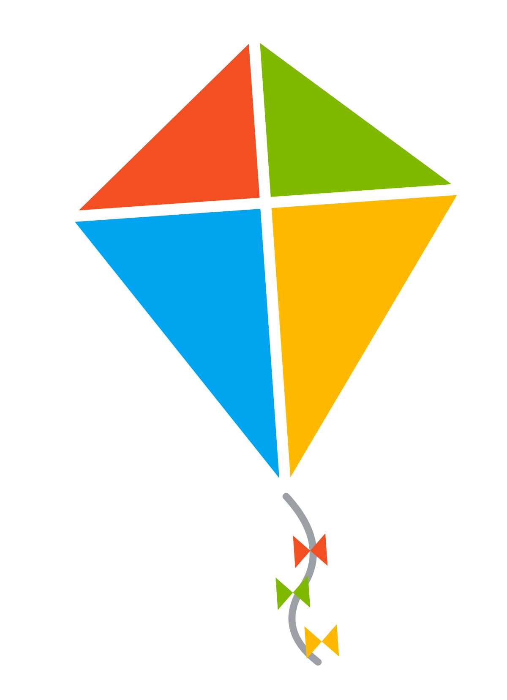

# kite-mark

The **kite mark** — the visual identity of the RAPP kited neighborhood. The Microsoft four‑colour
logo **turned on its point and stretched at the bottom into a real kite.** When a vTwin is *kited*
(hosting), it shows this mark over a **scan‑to‑join** QR. It is the canonical sign of a hosted
neighborhood — and the thing an adopter can't unsee.

## The mark

- **Four panels, on point:** red upper‑left `#F25022`, green upper‑right `#7FBA00`,
  blue lower‑left `#00A4EF`, yellow lower‑right `#FFB900` — the two **lower** panels **stretched**
  so the bottom comes to a long point (a kite, not a diamond).
- **White spars** (the cross) + white outline; a **bow‑tie tail** trails from the bottom point.
- It **sways** gently (≈ ±6–7°, ~3.4–3.6 s) — `kite-mark.svg` self‑animates via SMIL.
- **Reference geometry** (`viewBox 0 0 100 134`): corners **T** `50,6` · **L** `10,40` ·
  **R** `90,40` · **B** `50,98`; spars cross at `50,40`; tail + three bow‑ties below **B**.

## Files

| File | Use |
|------|-----|
| `kite-mark.svg` | scalable, self‑animating — UI, favicons, hero marks |
| `kite-mark.png` | transparent 2× raster — featured images, slides, social cards |

## The vocabulary it belongs to

A **vTwin** that's hosting is a **kited twin**, flown on a **string** by a **doorman**,
**tethered** to a local brainstem, in a **sealed** **kited neighborhood** you **scan to join** as a
**neighbor** — and when you want it forever, you **graduate** it to a **cloud neighborhood.** Own
the words; own the mark. (Spec: [rapp-neighborhood-protocol](https://github.com/kody-w/rapp-neighborhood-protocol) §2.)

## Note

The mark is a derivative of the Microsoft logo; treat brand/trademark use accordingly. MIT © Kody Wildfeuer (code/assets).
